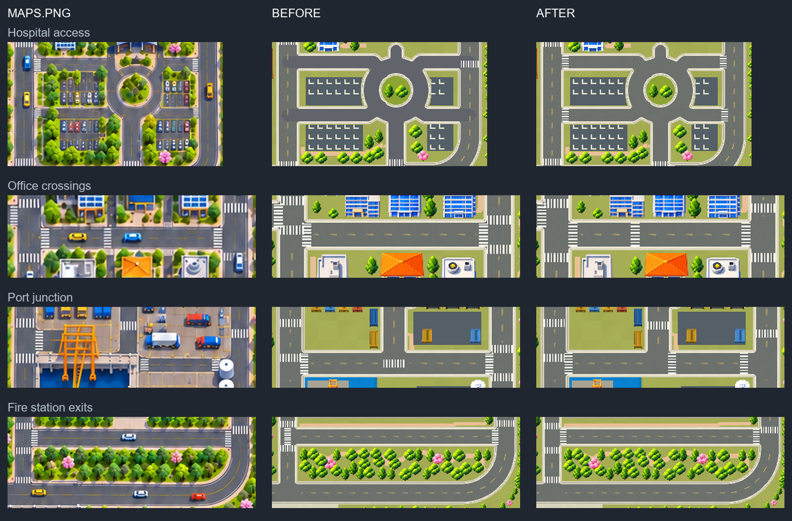

# HospitalCirculation 색상 / Maps.png 횡단보도 검토

HospitalCirculation의 Scene Renderer에 일반 Asphalt와 동일한 `RoadDepth.mat`를 연결했다. 색상뿐 아니라 표면 질감과 셰이더도 공유한다.

941×1672 `Maps.png`를 상·중·하 구역 및 병원·항만 상세로 확대해 횡단보도의 반복 흰 띠를 확인했다. 이미지 분석 후보를 시각적으로 확인하고, 차량·차선·포장 패턴을 제외했다. 병원 네 진입로, 업무 구역 중간 횡단보도, 항만·소방서 주변 누락을 보완하고 교차로 중앙·중복·원본에 없는 위치를 제거했다.

- 기존 158곳 → 최종 **160곳**: 13곳 추가, 11곳 제거.
- 기존 위치와 대응되는 147곳 중 139곳의 종방향 위치를 보정했다. 0.5px의 작은 보정도 이 수치에 포함한다. 35곳의 차도 폭도 현재 도로에 맞췄다.
- 횡단보도 아래 노란 중앙선과 이전 위치의 빈 구간을 함께 갱신했다.

원본의 도로 중심·폭은 현재 설계 메시와 몇 픽셀 차이가 있으므로 **도로를 따라가는 위치는 원본에서 읽고, 도로를 가로지르는 중심·폭은 현재 차도에 맞췄다.** 항만 서쪽 접근로는 원본의 굽은 접근로와 현재 직선 접근로가 다르므로 같은 접근로의 위치로 대응시켰다. `CrosswalkPlacements.json`의 `sourceX/sourceY`와 `x/y`에 양쪽 좌표를 남겼다. 우측 두 커브 사이의 체크무늬 보행 연결부는 차도를 가로지르는 횡단보도가 아니므로 Crosswalks에 추가하지 않았다.

Unity 6000.3.23f1의 복제 검증 프로젝트에서 현재 Scene을 열고 941×1672 및 480×854 화면을 렌더링했다. HospitalCirculation/Asphalt가 같은 Material을 공유하는지 확인했고, 누락 Script/Sprite/Prefab 및 Scene·셰이더 오류는 0이었다. 도로 밖 횡단보도 및 노란 중앙선과의 겹침 면적은 0이다.

이번 후속 수정은 Crosswalks/CenterDashes 메시 2개와 병원 Renderer 재질, SourceTrace의 횡단보도 목록에 적용했다. 차도·연석을 포함한 다른 도로 메시 15개, Scene Transform/Sprite 배치, 카메라 및 Collider 79개는 유지했다. 실제 검증한 파일과 작업 파일의 해시도 일치한다. WebGL 재빌드·배포는 수행하지 않았다.

위치·변경 기록: `CrosswalkPlacements.json`, `PlacementQA.json`, `UnityQA.json`, `VerificationManifest.json`. 검증 도구는 ignored `Temp/CrosswalkReview`, 복제 프로젝트는 `Temp/B`에 있다.

소방서 우측 위 횡단보도(id 141)는 후속 확인에서 T자 교차로 중앙에 걸친 문제가 발견되어, 현재 차도 기준 y=1117 → **1101**로 북쪽 진입부에 옮겼다. 차도 폭과 횡단보도 수는 유지하고, 교차로 북쪽 경계와 3 reference px 간격을 확보했다. 원본 좌표는 기록에 보존했으며 이 지점은 현재 교차로 구조를 기준으로 수동 보정했다. [해당 위치 수정 전후](FireStationNorthEastFix.png)에서 확인할 수 있다.
