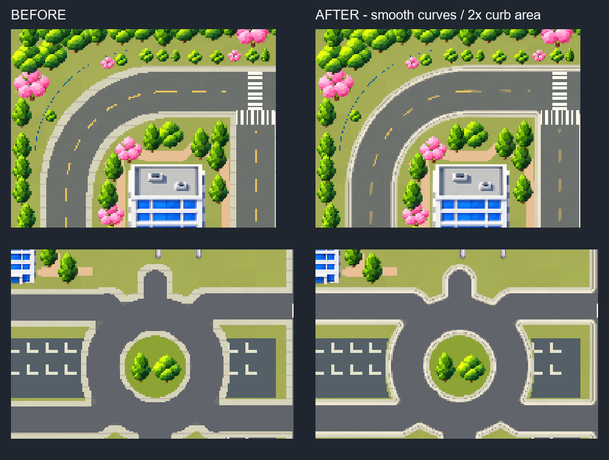

# 곡선 도로와 연석 수정

`NewGamePlay`의 사각형 단위 도로 메시를 연속 곡선으로 삼각분할한 메시로 교체했다. 외곽 커브, 병원 회차부, 연결부의 보도와 차선에 부드러운 경계를 적용하고, 기존 도로와 같은 아스팔트 재질을 사용한다.

연석의 고형 면적은 원본 좌표 기준 28,348 → 56,696으로 **2배**다. 도로 바깥으로 확장하며, 연석의 수직 폭은 약 2.061 reference px / 0.258 Unity unit이다. 밝은 상면과 안쪽·바깥쪽 음영을 기존 포장 셰이더로 표현했다.

저장된 메시의 본체 삼각형 면적은 기존의 1.9966배다. 곡선 단순화·정점 저장에 따른 목표 면적과의 차이는 약 0.17%이며, 반투명 가장자리 보정은 이 면적에서 제외했다.

Unity 6000.3.23f1의 별도 검증 프로젝트에서 실제 Scene을 열어 941×1672, 480×854 화면을 렌더링했다. 누락 Script/Sprite/Prefab, 셰이더 오류 및 Scene 검증 오류는 0이다. 도로망은 한 연결 성분이며, 도로 밖 차선과 도로·연석의 고형 면 겹침은 0이다. 원래 중심선·설계 차도 폭, 카메라, 모든 오브젝트 Transform과 Sprite 배치는 유지한다.

검증 수치: `GeometryQA.json`, `SerializedMeshQA.json`, `UnityQA.json`. 변경 도로 메시 10개 외의 메시 31개 및 Collider 79개는 유지한다. 검증 도구와 복제 프로젝트는 ignored `Temp/RoadSmoothWork`, `Temp/B`에만 두었다. WebGL 재빌드·배포는 이 작업에 포함하지 않았다.

후속 작업에서 병원 도로 재질과 횡단보도·중앙선을 수정했다. 위 해시·화면은 곡선 작업 완료 당시의 기록이며, 최신 결과는 [횡단보도 검토](../NewGamePlayCrosswalkReview/README.md)에 있다.
