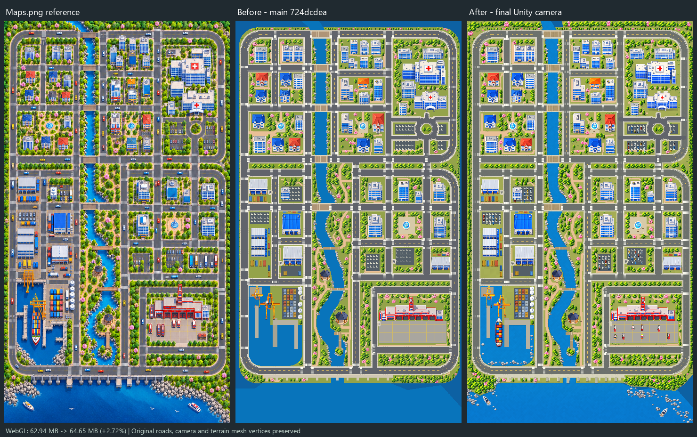

# NewGamePlay — Maps.png 비교 및 경량 명암 보강

작업 시작 시 로컬 HEAD와 GitHub main은 모두 `724dcdea60dae3a4c5c65832999676ba3950aa23`이었다. `Assets/Images/Maps/Reference/Maps.png`를 실제 Unity 카메라 화면과 구역별로 비교하고, 누락된 장식과 비율·명암을 보강했다. 아래 검증 결과는 현재 Scene의 SHA256 `869e7563cac62835a3c0456cc97ecb2b97fd3e502d8cf71f2c11f644358b40a6`에 해당한다.

## 원본 분석과 Scene 비교

좌표는 941×1672 원본의 좌측 상단 기준 픽셀이다. [구역 번호 이미지](ReferenceRegions.png)와 [실제 상세 비교](DetailComparison.png)를 함께 볼 수 있다.

| 구역 | Maps.png에 있는 요소 | 작업 전 차이 | 반영한 내용 |
| --- | --- | --- | --- |
| 1. 북쪽 주거·공원, x55–287/y75–562 | 주택·아파트, 분수 정원, 낮은 수풀, 수관 아래 짧은 그늘 | 주요 건물과 살구색 길은 있으나 식생·지면 접촉감이 부족 | 큰 주택 일부를 4% 축소, 실제 녹색 군집에 낮은 식생과 접촉 그림자 추가 |
| 2. 북쪽 상업, x430–622/y76–565 | 높은 업무동, 작은 가로수·화단, 따뜻한 정원길 | 큰 상업 주택과 평평한 지면 | 해당 주택 9% 축소, 수관 아래 잔디 군집·저층 식생·짧은 음영 보강 |
| 3. 병원, x650–886/y91–563 | 적십자 병원 2동, 조경, 주차 차량, 회차 광장 | 병원 비율이 크고 주차 공간에 차량이 거의 없음 | 본관·보조동 6% 축소, 주차 차량 및 건물 접촉 그림자 추가, 회차 통로 유지 |
| 4. 중앙 하천·정원, x317–489/y595–1434 | 굽은 강, 양쪽 돌, 정자, 분홍 꽃과 산책길, 강둑 음영 | 나무·돌·길은 있으나 강둑과 수면이 평평 | 강둑 접촉 음영, 수면의 작은 면 대비, 정자 1동 12% 축소, 벤치·등주·수풀 추가 |
| 5. 서쪽 산업, x56–282/y647–1077 | 창고·물류센터, 파랑·노랑 컨테이너, 적재 공간 | 이전 단계의 컨테이너 24개는 있음, 창고 1동이 크게 보임 | 해당 창고 6% 축소, 기존 컨테이너 Tint 유지, 바닥·건물 명암과 주차 차량 보강 |
| 6. 항구, x55–282/y1101–1433 | 컨테이너 화물선, 크레인 2개, 연속 사일로, 물가 돌 | 화물선과 사일로 1개 누락, 크레인 1개가 큼 | 화물선 1개·사일로 1개 추가, 크레인 16% 축소, 항구 물가 돌·선박 접촉 음영 보강 |
| 7. 소방서, x584–879/y1130–1356 | 출동 차량, 뒤·옆 녹지, 앞마당, 나무·화단 | 출동 차량 누락, 뒤쪽 저층 식생 부족 | 소방차 5대·구급차 3대 배치, 진입 통로를 피해 정원 식생 추가, 보조 건물·인근 분수 6% 축소 |
| 8. 외곽·남쪽 해안 | 두꺼운 외곽 수관 띠, 해안 숲·불규칙한 돌, 레저 보트 2척, 교량 교각 | 테두리 녹지 폭이 좁아 작은 점처럼 보임, 배·교각·해안 돌이 부족 | 나무 288그루, 별도 외곽 녹지 바탕, 해안 돌 군집, 레저 보트 2척과 교각 머리 13개 추가 |

주차 차량은 병원과 도시 주차장 합계 76대이며, 출동 차량 8대는 별도다. 기존 구급차 Sprite를 장식 Prefab으로 재사용했다. 주요 하천·항구 지형과 모든 도로·보도·교차로·다리 Mesh의 원래 정점은 그대로다. 외곽에는 원본처럼 숲이 놓일 땅을 보이게 하는 **별도 녹지 Mesh**를 추가했으므로, 화면 테두리와 해안 모서리의 물로 보이던 일부 영역은 녹지로 바뀐다. 이 Mesh에는 충돌체가 없다.

## 비율·명암·용량

- 큰 기존 나무 341그루는 중심·회전·종류를 유지하고 가로·세로를 함께 4% 줄였다. 건물·시설 11개는 위 표처럼 균일 축소했다. 전체 나무는 1205그루다.
- 강변 돌 128개에 해안·항구 돌 97개를 추가해 총 225개다. 기존 컨테이너 44개와 산책로 14개 Mesh를 유지했다.
- 작은 식생 1598군집, 원본 녹색 위치의 넓은 수풀 162군집, 벤치 15개·등주 13개를 고정 Mesh로 표현했다. 수풀에는 작은 밝은 면과 어두운 면을 함께 넣었다.
- 나무·돌·건물·차량의 짧은 접촉 그림자, 수관 아래 잔디 음영, 강둑 접촉 음영, 선박 주변 수면과 포말을 추가했다. Sprite 대비 1.10·채도 1.06으로 기존 면 명암을 분리하고, 흰 지붕과 컨테이너 Tint를 유지했다.
- 잔디·포장·아스팔트에는 작은 면 변화, 물에는 정적인 마름모 면과 강/바다 깊이 차이, 목재에는 이음선을 넣었다. 후처리·실시간 그림자·Normal/AO/Mask Texture·런타임 생성 스크립트는 추가하지 않았다.
- 새 PNG 4개는 자동차·소방차·화물선·레저 보트다. Built-in `image_gen`으로 제작하고 투명 여백 정리·축소만 수행했다. [생성 프롬프트](AssetPrompts.json), [리소스 목록](AssetInventory.json), [미리보기](NewAssetContactSheet.png)를 기록했다. 최종 파일은 `Assets/Images/Maps/MapDetails`에 있으며 합계 76,272 bytes, 최대 변 128/256px다. 기존 구급차와 함께 512px Atlas에 1회씩 담았다. 배치된 차량·보트의 가로세로 비율은 원본 Sprite 비율과 같다.
- 새 고정 Mesh 10개, 정점 120,728개다. Color는 RGBA8, 인덱스는 16bit로 저장했다. 기존 리소스는 복제하지 않았다.
- 같은 검증 설정의 WebGL 결과는 **62,937,507 → 64,647,819 bytes**, 증가 **1,710,312 bytes / 2.72%**다. 비교는 이전 단계의 WebGL 검증 빌드이며 실제 배포 압축 크기나 Android APK 크기는 별도다. Maps.png는 빌드 의존성에 포함되지 않는다.

`City/StaticDecoration/MapVisualPolish` 아래의 ParkingVehicles, DispatchFleet, HarborShipping, CoastalRocks, HarborRocks, OuterForest, SurfaceDepth에 저장했다. 기존 Prefab 원본을 변경하지 않고 Scene 인스턴스에만 크기·Material override를 적용했다. Camera, 기존 Sprite의 중심·종류·회전과 원래 지형 Mesh 정점을 유지했다. 추가 Collider·Rigidbody·MonoBehaviour는 0개다.

## 검증과 남은 차이

[LayoutQA.json](LayoutQA.json)의 주차 차량/외곽 나무 도로 침범은 0이다. [UnityQA.json](UnityQA.json)에서 누락 Script·Sprite·Prefab, Shader 오류와 Scene 실행 오류가 0이며 Collider 수 79개를 유지한다. [BuildQA.json](BuildQA.json)은 WebGL 성공, 빌드 오류 0이다. [BrowserQA.json](BrowserQA.json)에서 480×854 WebGL2 화면 로드, JS/Console·네트워크 오류 0을 확인했다. [WebGL 화면](WebGL480x854.png), [원본 크기 카메라 화면](Camera941x1672.png), [파일·빌드 SHA256](VerificationManifest.json)을 저장했다. 검증용 C#과 오프라인 작업 도구는 ignored Temp에만 있다.

원본과 주요 구역·요소·크기·음영을 가깝게 맞췄지만 픽셀 단위 동일 복제는 아니다. 기존 도로 폭, 하천 곡선·항구 선착장 윤곽, 현재 건물 Sprite의 형태는 유지되므로 차이가 남는다. 움직이는 일반 차량·새·수면 애니메이션은 추가하지 않았다. 실제 휴대폰의 FPS·차량 주행은 이 정적 화면 검증에 포함되지 않는다. Commit·Push·Merge는 수행하지 않았다.
